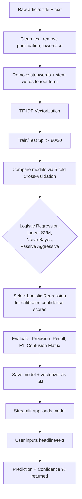

# 📰 Fake News Detector

A machine learning project that classifies news articles as **Real** or
**Fake** using TF-IDF text vectorization and Logistic Regression, deployed
as a live web app.

**🔗 Live app:** [https://methika0110-fake-news-detector.hf.space/](https://methika0110-fake-news-detector.hf.space/)

---


## 📸 Screenshots
 
<!--
Save your screenshots into a `screenshots/` folder in this repo, then
update the paths below to match your filenames.
-->
 
### Example Predictions
 
**Fake news detection:**

 
**Real news detection:**


**Known limitation, documented in-app:**

 
---

## 🧠 How It Works



---

## 🗂 Project Structure

```
fake-news-detector/
├── notebook/
│   └── Fake_News_Prediction_WELFake.ipynb   # Full training pipeline
├── app/
│   ├── streamlit_app.py                      # Deployed Streamlit app
│   ├── requirements.txt
│   └── Dockerfile
├── docs/
│   └── Project_Explanation_Guide.md          # Full write-up of every decision
└── README.md
```

> **Note:** `tfidf.pkl` and `fake_news_model.pkl` (the trained model files) are
> not included in this repo due to size — they're loaded directly by the
> live Hugging Face Space. Run the notebook yourself to regenerate them.

---

## 📊 Dataset

Trained on the **[WELFake dataset](https://www.kaggle.com/datasets/saurabhshahane/fake-news-classification)**
(72,134 articles, later cleaned to ~63,000 after removing duplicates/nulls),
which merges four popular fake-news datasets (Kaggle, McIntire, Reuters,
BuzzFeed Political) specifically to reduce overfitting to any single
source's vocabulary or writing style.

---

## 🔍 Key Decisions & Why

**Why Logistic Regression, when other models scored higher accuracy?**
Cross-validation showed Linear SVM and Passive Aggressive both outperformed
Logistic Regression by ~2 percentage points. Logistic Regression was chosen
anyway because it natively outputs calibrated probabilities
(`predict_proba()`), enabling the app to show a confidence percentage
("92% confident this is fake") rather than just a binary label — a
deliberate accuracy-for-interpretability tradeoff.

**Why switch datasets partway through?**
An earlier version trained on a narrower, single-source dataset (~20,800
articles, mostly 2016-era U.S. political news) hit ~98% accuracy — but this
reflected overfitting to one source's style, not genuine generalization.
Switching to WELFake dropped accuracy to ~94%, which is expected and
appropriate: a harder, more diverse dataset should reduce accuracy while
producing a more broadly reliable model.

**Two silent bugs were found and fixed during development:**
1. A variable-name typo caused stemming/stopword-removal to silently never
   run, despite the code appearing to work.
2. The TF-IDF vectorizer was originally fit on the entire dataset before
   the train/test split, causing data leakage.

Full details on every decision, plus a Q&A section for defending this
project, are in [`docs/Project_Explanation_Guide.md`](docs/Project_Explanation_Guide.md).

---

## ⚠️ Known Limitation

This model can be **confidently wrong** on inputs unlike its training
data — for example, obvious satire or short out-of-context factual
statements may be misclassified with high confidence. This happens because
TF-IDF captures word-frequency patterns, not truthfulness or plausibility;
the model has no fact-checking capability. This limitation is documented
directly in the app UI as well, rather than hidden.

---

## 🛠 Tech Stack

- **Python**, **scikit-learn** (TF-IDF, Logistic Regression, model comparison)
- **NLTK** (stopword removal, stemming)
- **Streamlit** (web app UI)
- **Docker** (deployment container)
- **Hugging Face Spaces** (hosting)

---

## 🚀 Running Locally

```bash
git clone https://github.com/<your-username>/fake-news-detector.git
cd fake-news-detector/app
pip install -r requirements.txt
streamlit run streamlit_app.py
```

You'll need `tfidf.pkl` and `fake_news_model.pkl` in the same folder —
generate these by running the notebook in `notebook/` end to end.

---

## 📈 Results

| Metric | Score |
|---|---|
| Test Accuracy | ~94% |
| Precision (avg) | ~0.94 |
| Recall (avg) | ~0.94 |
| F1-score (avg) | ~0.94 |

See the notebook for the full classification report and confusion matrix.
